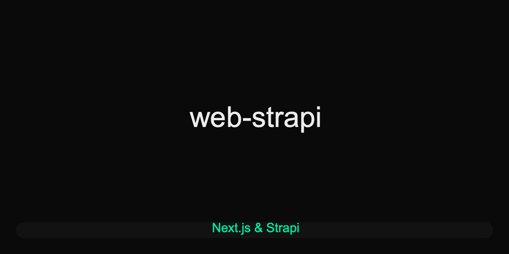

<p align="center">
  
</p>

# Web Strapi Monorepo Template

 > This repository is a ready-to-use template for building modern web applications with [Strapi](https://strapi.io/) and [Next.js](https://nextjs.org/). It provides a scalable monorepo structure using Yarn workspaces, shared configurations, and a seamless developer experience out of the box.

---

## Features

 - **Monorepo setup** powered by Yarn workspaces for efficient dependency management
- **Strapi backend** for flexible headless CMS and API
- **Next.js web frontend** for building performant user interfaces
- **Shared UI library** for reusable React components
- **Centralized TypeScript and ESLint configs** for consistency
- **Open Graph image** for improved social sharing

---

## Project Structure

```
├── apps/
│   ├── next/      # Next.js frontend app
│   └── strapi/    # Strapi backend app
├── packages/
│   ├── ui/        # Shared React UI components
│   ├── eslint-config/      # Shared ESLint config
│   └── typescript-config/  # Shared TypeScript config
├── opengraph.png  # Open Graph image
└── package.json   # Root package.json with workspace config
```

---

## Getting Started

1. **Install dependencies** (using [Yarn](https://yarnpkg.com/) recommended):

   ```sh
   yarn install
   ```

2. **Develop locally**:

   ```sh
   yarn dev
   ```

   Or run a specific app:

   ```sh
   yarn workspace next dev
   yarn workspace strapi dev
   ```

3. **Build for production**:
   ```sh
   yarn build
   ```

---

## Included Tools

 - **Yarn workspaces** for monorepo management
- [Strapi](https://strapi.io/) for backend CMS/API
- [Next.js](https://nextjs.org/) for frontend
- [TypeScript](https://www.typescriptlang.org/) for type safety
- [ESLint](https://eslint.org/) and [Prettier](https://prettier.io/) for code quality

---

## Useful Links

 - [Yarn Workspaces Documentation](https://yarnpkg.com/features/workspaces)
- [Strapi Documentation](https://docs.strapi.io/)
- [Next.js Documentation](https://nextjs.org/docs)

---
